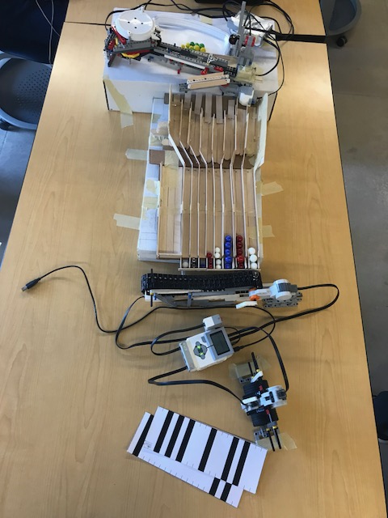

# Pellet-Sorter
This repo showcases the pellet sorter my team and I developed during my freshman year of college. The robot was built with the LEGO Mindstorms kit, budget items such as popsicle sticks, cardboard, tape and programmed with LabVIEW. The purpose of this project was to build a prototype machine for the delivery of water treament pellets (marbles) in third world countries. 

## Functions
  * Sort collection of marbles by size, color, and material (metallic and plastic)
  * Gather and dispense correct dosage specified by bar codes
  * Dispose of unwanted pellets
  * Barcode scanning, color and material detection via color sensor
  * Pellet size detection via ultrasonic sensor
  * Sorting of marbles via rotaional motors

## Design

Link to video:
https://drive.google.com/file/d/1ghuc0h7ElsyhmCxdIfVm9eh3FYPljAYP/view?usp=sharing
